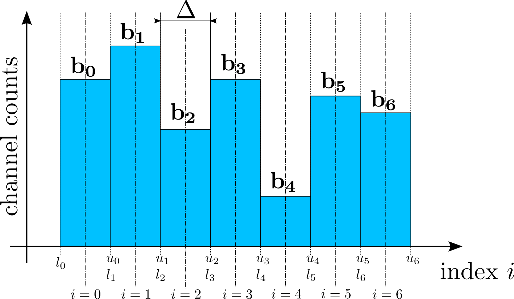
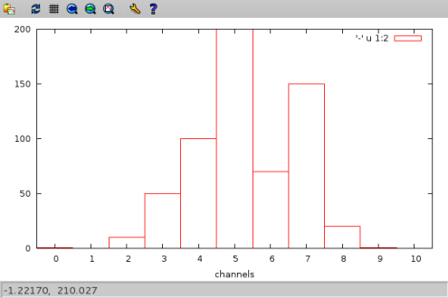
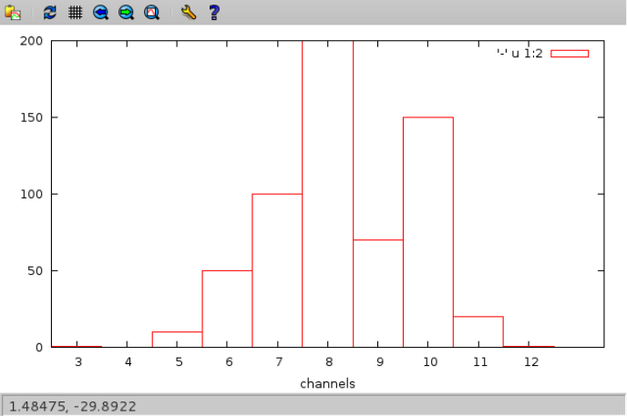
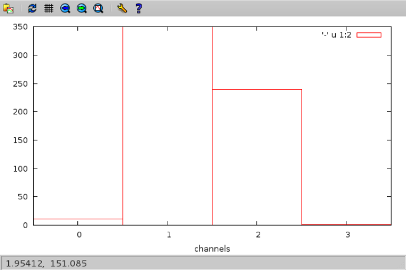

======
mcaops
======

Synopsis
========

.. code-block:: bash

    mcaops [GENERAL OPTIONS] [OPS] [OPS OPTIONS] [INPUT FILE,...]

where

+--------------------+----------------------------------------------------+
| *GENERAL OPTIONS*  | are options valid for all commands available       |
|                    | for :program:`mcaops`                              | 
+--------------------+----------------------------------------------------+
| *OPS*              | determines the operation which to apply to the     |
|                    | input data                                         |
+--------------------+----------------------------------------------------+
| *OPS OPTIONS*      | are options which are specific for the operation   |
|                    | selected                                           |
+--------------------+----------------------------------------------------+
| *INPUT FILE*       | determines the source from which to obtain the     |
|                    | data to process.                                   |
+--------------------+----------------------------------------------------+

Description
===========

:program:`mcaops` applies certain mathematical operations onto MCA data. All
results are written to standard output. This allows several :program:`mcaops``
commands to be chained by using the pipe operator. 

Which operation to perform is controlled via the *OPS* argument which is passed
as the first command line argument to :program:`mcaops`.
Currently the following operations are available:

=======   ====================================================
Command   Description
=======   ====================================================
max       find the maximum value in the MCA data 
maxpos    find the position of the maximum value
min       find the mininum value in the MCA data
minpos    find the minimum location in the MCA data
sum       add all value in the spectrum (see :ref:`sum-operation-reference`)
average   compute the average from the entire MCA data (see :ref:`average-operation-reference`)
rebin     rebin the spectrum to new bin sizes (see :ref:`rebin-operation-reference`)
scale     scale the bin centers of the spectrum (see :ref:`scale-operation-reference`)
dump      dump channel and mca data unchanged to standard out
=======   ====================================================

One can roughly distinguish two kinds of operations: accumulating and
non-accumulating operations. The former ones reduce the input data typically to
one number while the latter ones do not.  Most of the available operations can
be easily classified into one of the two kinds. The only exception is the 
**rebin** operation though it reduces the number of bins in most cases it
does not go that far to virtually sum all data into a single bin.

Obtaining input
---------------

Every command expects as its input arguments two arrays whose size is equal to
the MCAs number of channels. The first array provides the channel indexes while
the second one the actual MCA data. If the channel indexes or bin center
values are not provided, :program:`mcaops` generates a set of channel indexes by
itself starting from with an index value provided by the 
:option:`--auto-index-offset`. By default this value is 0.

:program:`mcaops` can read MCA data from three sources

* standard input (see :ref:`standard-input-reference`)
* a single or multiple ASCII files (see :ref:`ascii-input-reference`)
* a single or multiple NeXuS files (see :ref:`nexus-input-reference`)

The way how :program:`mcaops` treats the data depends on the particular data
source used to obtain the MCA data.

.. _standard-input-reference:

Reading data from standard input
^^^^^^^^^^^^^^^^^^^^^^^^^^^^^^^^

By default, when reading data from standard input, :program:`mcaops` assumes
that the entire data it collects until the end of the stream belongs to a
single MCA spectrum. 

.. code-block:: bash

    $ cat mca.dat | mcaops sum 
    10234452.0

If the number of channels *n* is provided by the
:option:`--mca-size` option in the general options section, every block of
*n* input values from the stream is treated as an individual MCA spectrum. 

.. code-block:: bash

    $ cat mca.dat | mcaops -s128 sum
    1234.0
    8445.0
    2391.0

.. _ascii-input-reference:

Reading data from ASCII files
^^^^^^^^^^^^^^^^^^^^^^^^^^^^^

Currently the only ASCII format supported are :file:`.fio` files as produced by
the :program:`online` data acquisition system used at some beamlines at DESY.
By default :program:`mcaops` assumes that every FIO file contains only a single
MCA spectrum. Hoever, as FIO files can store several named columns of data 
in a single file the global option :option:`--mca` must be used to tell 
:program:`mcaops` from which column to read the MCA data.

.. code-block:: bash

    $ mcaops -mmca_data sum testdata.fio

For files with several data columns the :option:`--mca` is mandatory.
If the file also contains columns with the channel index or bin center data one
can use the :option:`--channels` or :option:`--bins` respectively to inform
:program:`mcaops` where to find this information

.. code-block:: bash

    $ mcaops -benergy -mmca_data sum testdata.fio

Unlike :option:`--mca`, the :option:`--bins` and :option:`--channels` options
are in no case mandatory as an channel index array will be generated
automatically if not provided by the user.

MCA data can also be read from several FIO files using a numeric range 

.. code-block:: bash

    $ mcaops sum mca_scan_%05i.fio:0:101

.. _nexus-input-reference:

Reading data from NeXuS files
^^^^^^^^^^^^^^^^^^^^^^^^^^^^^

Besides ASCII files, :program:`mcaops` can also read data from one or several
NeXuS files. As for ASCII files the :option:`--mca` must be used to determine the
location of the MCA data. However, unlike for ASCII files, :option:`--mca` does
not provide a column name but the path to a particular NeXuS object that stores
the MCA data. 

.. code-block:: bash

    $ mcaops -m/:NXentry/:NXinstrument/:NXdetector/data sum mca_data.nxs

The data field can be either a one or a two dimensional field. In the former
case the field is considered to store a single spectrum while in the latter one
the field is assumed to store several spectra where the first dimension runs
over the number of spectra and the second dimension represents the MCA channels. 

To reduce the writing effort one can use the general option :option:`--base`
to set a base path. The previous example would then look like this 

.. code-block:: bash

    $ BASE=/:NXentry/:NXinstrument/:NXdetector
    $ mcaops --base=$BASE -mdata sum mca_data.nxs

Like for ASCII files we can also use :option:`--channels` and :option:`--bins`
to tell :program:`mcaops` where to find channel index or bin center information
respectively. With these two options the benefits of :option:`--base` become
even more obvious 

.. code-block:: bash

    $ BASE=/:NXentry/:NXinstrument/:NXdetector
    $ mcaops --base=$BASE -mdata -benergy sum mca_data.nxs

Multiple NeXuS files can be processed provided that the MCA data and possible
channel index or bin center data can be reference by the same path

.. code-block:: bash

    $ BASE=/:NXentry/:NXinstrument/:NXdetector
    $ mcaops --base=$BASE -mdata -benergy sum mca_1.nxs mca_2.nxs

If the MCA files store several MCA spectra (data is a 2D field) first all the
spectra of the first file are processed, followed by the spectra of the second
file, and so on.

Writing output
--------------

Currently, :program:`mcaops` supports output only to standard output. The 
result data is written column like fashion

.. code-block:: text

    0 12139
    1 203
    2 1029943
    . .
    . .
    . .

where the first column are the bin centers or channel indices and the second
column contains the actual channel data. In some cases it might be useful to
suppress the channel data from the output. This can be achieved using the global
option :option:`--no-channel-output`. This reduces the above output to 

.. code-block:: text

    12139
    203
    1029943
    .
    .
    .

In the output stream, by default, the individual channels are separated by 
a carriage return. In particular when using :program:`mcaops` in batch mode and in
connection with :program:`nxtee` it is necessary to change this to a different
symbol as for :program:`nxtee` the carriage return would indicate a new data
point. A reasonable choice would be to change the channel separator character
to a whitespace. This can be achieved by the global option 
:option:`--channel-sep`. With :option:`--channel-sep=' '` the above output
would alter to 

.. code-block:: text
    
   12139 203 1029943

It must be noted that :option:`--channel-sep` implies
:option:`--no-channel-output` as there is not unique way how to write the channel 
data. However, as :option:`--channel-sep` is typically used in batch mode 
where we assume that the bin/channel data is the same for all input files
this is not a serious limitation.

Available operations
--------------------

MCA terminology 
^^^^^^^^^^^^^^^

An MCA basically collects a histogram of events.  Before discussing the
individual operations in more detail some terms have to be defined. 

+----------------+----------------------------------------------------------+
| Symbol         | Description                                              |
+================+==========================================================+
| :math:`i`      | denotes the channel index                                |
+----------------+----------------------------------------------------------+
| :math:`b_{i}`  | the MCA value at channel :math:`i`                       |
+----------------+----------------------------------------------------------+
| :math:`\Delta` | the width of the MCA channels. It is assumed that all    |
|                | channels have the same width.                            |
+----------------+----------------------------------------------------------+
| :math:`c_{i}`  |  the bin center value of channel :math:`i`               |
+----------------+----------------------------------------------------------+
| :math:`N`      | the total number of channels in the MCA                  |
+----------------+----------------------------------------------------------+

Furthermore there are some definitions for a region of interest (ROI)

+-----------------------+---------------------------------------------------+
| Symbol                | Description                                       |
+=======================+===================================================+
| :math:`r_{\rm start}` | start index of the ROI                            |
+-----------------------+---------------------------------------------------+
| :math:`r_{\rm stop}`  | stop index of the ROI. The stop index resembles   |
|                       | Python slices so it does not point to the index   |
|                       | of the last channel but to the index of the       |
|                       | channel right after the last.                     |
+-----------------------+---------------------------------------------------+

The *min*, *max*, *minpos*, *maxpos* operation
^^^^^^^^^^^^^^^^^^^^^^^^^^^^^^^^^^^^^^^^^^^^^^

None of these operations require an additional argument and do what their names
imply. The *min* and *max* print the maximum channel count 
to standard output while *minpos* and *maxpos* look for the bin
index or bin center value of the minimum or maximum value respectively. 
In cases where *min* or *max* find multiple occurances of the
minimum or maximum value the first one is taken. This is also true for 
*minpos* and *maxpos*.

.. _sum-operation-reference:

The *sum* operation
^^^^^^^^^^^^^^^^^^^

In the simplest case this operation simply sums up all the bin values of the MCA
spectrum

.. math:: 
    
   s = \sum_{i=0}^{N-1} b_{i}

where :math:`i` is the channel index, :math:`N` the number of channels, and
:math:`b_{i}` the data value at the :math:`i`-th channel. :math:`s` is the
result written to standard output.  If a ROI is set the sum runs from 

.. math::

   s = \sum_{i=r_{start}}^{r_{stop}-1} b_{i}

.. _average-operation-reference:

The *average* operation
^^^^^^^^^^^^^^^^^^^^^^^

Computes the average over all bins in the MCAs histogram

.. math::
 
   a = {{1}\over{N}}\sum_{i=0}^{N-1}b_{i}

and in the presence of a ROI

.. math::

 a = {{1}\over{r_{\rm stop}-r_{\rm start}}}
     \sum_{i=r_{\rm start}}^{r_{\rm stop}-1}b_{i}
     
where in both expressions :math:`a` denotes the average.

.. _rebin-operation-reference: 

The *rebin* operation
^^^^^^^^^^^^^^^^^^^^^

The *rebin* command collates several bins into one. The critical parameters
here is called :math:`b` which is the number of bins that should be collated.
:math:`n` denots the number of bins of the original histogram.  The new number
of bins can be computed with

.. math::

   \bar n = \biggm\lfloor {{n}\over{b}} \biggm\rfloor + (1)

If :math:`n` is not an integer multiple of :math:`b` we have to add an extra
bin which comes from the last term in the previous expression.  Technically
rebining is done by averaging the values stored in the original :math:`b` bins
and store the result in a single bin

.. math::

   \bar d_j = {{1}\over{\bar n}}
           \sum_{i=r_{\rm start}}^{r_{\rm stop}-1}d_{jb+i}

where :math:`j=1,\ldots, n_r` and :math:`r_j` denotes the value of the
:math:`j`-th bin in the rebinned histogram. Again we have to take care for the
situation where the :math:`n` is not a multiple integer of :math:`b`. In this
case the last bin value for the new histogram is computed with

.. math::

   \bar d_{\bar n} = {{1}\over{n \bmod b}}
                      \sum_{i=n- n\bmod b}^n d_i.

In some cases not only the data should be recomputed but also the center values
of the bins. The procedure is actually the same as for the bin data shown above.
However, instead of the :math:`d_j` averaging is done over the :math:`c_j`.

.. _scale-operation-reference:

The *scale* operation
^^^^^^^^^^^^^^^^^^^^^

The *scale* command of :program:`mcaops` assigns new values to the center
values of the histogram bins with respect to a reference bin.  To compute the
new center values from incoming data several parameters are required which must
be either provided by the user or in some cases can be inferred automatically
from the data.  Those parameters are 

* the index of the reference bin :math:`i_{ref}`
* a center value for the reference bin :math:`c_{ref}`
* and the new width of the binds :math:`\Delta b`

The index of the reference bin can either be computed from the maximum position
of the histogram or can be passed as a command line option by the user. With
these parameters the new center values for the binds can be computed using the
following linear function

.. math::

   c_i = c_{ref} + \Delta b (i-i_{ref})

The *dump* operation
^^^^^^^^^^^^^^^^^^^^

This operation does virtually nothing. It only adds the channel index data and
writes it along with the MCA data to standard out. 

.. code-block:: bash

    $ cat mca.dat | mcaops dump 
    0 120.
    1 3434.
    2 948.
    4 9991023.
    ....
    ...
    ..

Program options
===============

In general effect a particular option passed to @command{mcaops} has on the
input data depends on the operation that should be carried out. H

General program options
------------------------
These options apply to all operations

.. option:: -h, --help

   Print a usage message and exit.

.. option:: -v, --verbose

   Produce verbose output, printing information regarding the specified options
   and objects.  All output is printed to standard error allowing you to
   redirect payload data to an other program while still watching debugging
   output.

.. option:: -q, --quiet

   Suppress all unnecessary output (the counterpart of :option:`--verbose`)

.. option:: --header

   print a header before dumping the output to standard out

.. option:: -c [COLNAME], --channels=[COLNAME]

   specifies the name of the data object storing the channel index or bin
   center data. For *FIO* files this is the name of a column within the
   file and for *NeXuS* files this is the path to a one dimensional field.
   This option has no effect if the data is read from standard input.

.. option:: -b, --bins

   the same as the :option:`--channels`

.. option:: -m [COLNAME], --mca=[COLNAME]

   specifies the name of the data objects storing the MCA data which
   should be processed. For *FIO* files this is the name of a column in
   the file and for *NeXuS* files it is the path to a one or two
   dimensional field.
   This option has no effect when the data is read from standard input.

.. option:: --auto-index-offset=[INDEX-OFFSET]

   if no bin center or channel index array is provided by the user,
   :program:`mcaops` is generating channel index data automatically starting
   from an index value determined by this option. The default value is
   :math:`0`.

.. option:: -r, --roi 

   a region of interest (ROI) to which the operation can be restricted. The
   value of this option is a numeric range [Add here a reference to range].

.. option::  -s, --mca-size

   this option provides the total number of channels of the input data. It only
   takes effect when data is read from standard input.

.. option:: --base

    base path for NeXus files. The value of this option is used as a prefix to
    every NeXus object used with :option:`--bins` and :option:`-m`.

.. option:: --channel-sep

   defines the channel seperator. By default this is a line '\n' character. 

.. option:: --no-channel-output

   do not print channel data to the output stream. 

Options for the *rebin* operation
---------------------------------

.. option:: -b [NBINS], --binsize=[NBINS]

   defines the number of bins that should be collated during rebining. 

.. option:: --noxrebin 

   do not rebin the x-axis. Instead use indices for the output. 

.. option:: --normalize 

   normalize the rebinned data.

Options for the *scale* operation
---------------------------------

.. option:: -c [CENTER], --center=[CENTER]

   defines the index of the center bin used for rescaling. By default the bin
   with the maximum signal will be used.

.. option:: -d [DELTA], --delta=[DELTA]

   defines the new width of the histogram bins

.. option:: -x [CENTERVALUE], --cvalue=[CENTERVALUE]

   the value of the center bin.

The *sum* and *max* command have no additional options.

Examples
========

For the examples two simple data files are generated which are located in the
example directory in the source distribution. The
first(:file:`examples/mcaops/test.dat`), contains MCA data with bin index
information starting at 0 while the second one (
:file:`examples/mcaops/test1.dat`) contains data with a bin index starting at
3.  We will use these files in the following examples along with the
:command:`cat` to simulate input from standard input. 
The content of the two example files is shown in the following figures

.. only:: html

    .. code-block:: bash

        $ GCMD="set xlabel \"channels\"; set xtics -2,1,12; plot '-' u 1:2 w boxes"
        $ cat test.dat | gnuplot -p -e "$GCMD" 
        $ cat test1.dat | gnuplot -p -e "$GCMD"

.. only:: texinfo

    .. code-block:: bash

        $ GCMD="set xlabel \"channels\"; set terminal dumb; set xtics -2,1,12; plot '-' u 1:2 w boxes"
        $ cat test.dat | gnuplot -p -e "$GCMD" 
        $ cat test1.dat | gnuplot -p -e "$GCMD"

gives

   
   The content of :file:`examples/mcaops/test.dat` as shown by Gnuplot.

   The content of :file:`examples/mcaops/test1.dat` as shown by Gnuplot.

The first examples deal with the two accumulating operations *sum* and
*max*.  Lets start with the accumulative commands.  To compute the sum
of the data stored use

.. code-block:: bash

    $ cat test.dat | mcaops sum 
    602

where the output, 602, is the sum of all data values stored in the MCA. The sum
operation does not depend on the channel index and this is independent of it.
For a better understanding of how channel data is used by the program have a
look at the output of *max*. 
For :file:`test.dat` we get the following result

.. code-block:: bash

    $> cat test.dat | mcaops max
    5   200

where the first number denots the channel index of the maximum bin and the
second the maximum value  of the MCA data. As we start indexing of bins at 0 we
get here the correct answer 5. 
Now lets have a look on the second file :file:`test1.dat`

.. code-block:: bash

    $> cat test1.dat | mcaops max
    8   200

If we would count the entries in the file we would see that the maximum
position is still 5 (when using 0 based counting). However, as the file
provides channel information we get the correct channel index from the program. 

In the next example lets have a look on the @command{scale} command.  This
command asigns new values to the bin center values with respect to a particular
reference bin. The reference bin can be either determined by the program (it
uses the channel number of the maximum data value) or can be passed by the
user. 
In the next example the program should automatically find the reference bin 

.. code-block:: bash

    $ cat test.dat | mcaops scale -d0.5 -x0.0
    -2.5    1
    -2      0
    -1.5    10
    -1      50
    -0.5    100
    0       200
    0.5     70
    1       150
    1.5     20
    2       1
    2.5     0
    
Using :file:`test1.dat` (the on where the bin index  starts with 3) we obtain
the same result

.. code-block:: bash

    $ cat test1.dat | mcaops scale -d0.5 -x0.0
    -2.5    1
    -2      0
    -1.5    10
    -1      50
    -0.5    100
    0       200
    0.5     70
    1       150
    1.5     20
    2       1
    2.5     0

In the case where we pass the reference bin manually the situation is quite
different. Lets repeat the two example but now pass the reference bin
explicitely. 

.. code-block:: bash

    $ cat test.dat | mcaops scale -d0.5 -x0.0 -c5
    -2.5    1
    -2      0
    -1.5    10
    -1      50
    -0.5    100
    0       200
    0.5     70
    1       150
    1.5     20
    2       1
    2.5     0

For :file:`test.dat` we obtain exactly the same result as before since the
maximum value has the bin index 5. Now lets see what happens to the data in file
:file:`test1.dat`

.. code-block:: bash

    $> cat test1.dat | mcaops scale -d0.5 -x0.0 -c5
    -1.000000000000000e+00	1.000000000000000e+00
    -5.000000000000000e-01	0.000000000000000e+00
    0.000000000000000e+00	1.000000000000000e+01
    5.000000000000000e-01	5.000000000000000e+01
    1.000000000000000e+00	1.000000000000000e+02
    1.500000000000000e+00	2.000000000000000e+02
    2.000000000000000e+00	7.000000000000000e+01
    2.500000000000000e+00	1.500000000000000e+02
    3.000000000000000e+00	2.000000000000000e+01
    3.500000000000000e+00	1.000000000000000e+00
    4.000000000000000e+00	0.000000000000000e+00

The scale is now shifted as the bin index in :file:`test1.dat` starts with 3.

.. code-block:: bash

    $ cat test.dat | mcaops rebin --noxrebin -b3
    0       11
    1       350
    2       240
    3       1
    $ cat test.dat | mcaops rebin --noxrebin -b3 | gnuplot -p -e "$GCMD"

   
:program:`mcaops` does not normalize the re-binned data by default. To
normalize the data use the :option:`--normalize`. 

.. code-block:: bash

    $ cat test.dat | mcaops rebin --noxrebin --normalize -b3 
    0       3.66667
    1       116.667
    2       80
    3       0.5

The :option:`--noxrebin` option tells the program to not rebin the x-axis.
Typically one would not use this option if the x-axis has some physical meaning
(instead of just bin numbers as in this example). 

Return value
------------
0 in case of success and -1 otherwise. 

