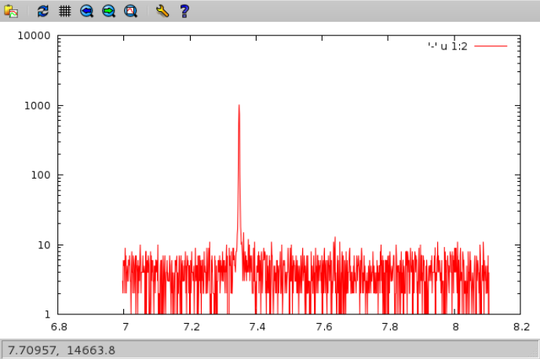
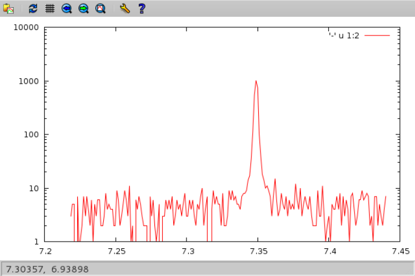

nxcat
=====

Synopsis
--------
output scalar data from a Nexus file

.. code-block:: text

    nxcat [OPTIONS] SOURCE [SOURCE ...]

Description
-----------

``nxcat`` prints the output of one or more fields stored in Nexus files to
standard out. The fields are specified by Nexus paths. It is thus possible 
to combine data not only from different fields but also from different 
files. :program:`nxcat` produces output in tabular form, thus, only scalar
fielss (one dimension) are currently supported. This may change in future. 

Options
-------

The programm takes the following options:

.. option:: -h, --help   

   print short program help

.. option:: --header     

   Print header with column name and unit information to the output.

.. option:: -s [FINDEX], --start=[FINDEX]  

   first index

.. option:: -e [LINDEX], --end=[LINDEX]    

   last index

Examples
--------

A good use case for :program:`nxcat` would be for instance plotting data stored
in a NeXus file using :program:`gnuplot`. In the simplest case one can do
something like this

.. code-block:: bash

    $ GCMD1="set log y; plot '-' u 1 w l"
    $ GCMD2="set log y; plot '-' u 1:2 w l"
    $ BASE="file.nx:///:NXentry/:NXinstrument"
    $ CHAN5=$BASE/channel_5
    $ nxcat $CHAN5/polar_angle $CHAN5/data | gnuplot -p -e "$GCMD2"

yielding 

The plotting range can easily be reduced by only reading a section of the data
which can be specified by the @option{-s} and @option{-e} option

.. code-block:: bash

    $ nxcat -s200 -e400 $CHAN5/polar_angle $CHAN5/data | gnuplot -p -e "$GCMD2"

By default :program:`nxcat` just prints the data to standard out as shown in this
example

.. code-block:: bash

    $ nxcat -s1 -e4 $CHAN7/polar_angle $CHAN7/data 
    6.99727         2 
    6.99829         6 
    6.99941         5 

and for the previous plotting job this would be perfectly ok. However, some
programs may require a name and a unit for each of the columns. Using the
:option:`--header` makes :program:`nxcat` printing a short header holding the name
and the unit of each column 

.. code-block:: bash

    $ nxcat --header -s1 -e4 $CHAN7/polar_angle $CHAN7/data 
    #polar_angle (degrees)
    #data (counts)
    6.99727         2 
    6.99829         6 
    6.99941         5 

Return value
------------
0 in the case of success, 1 otherwise

