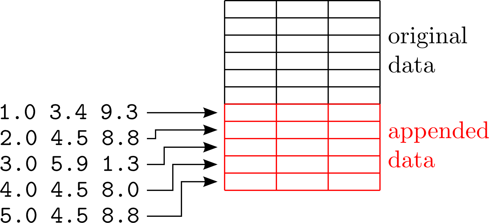
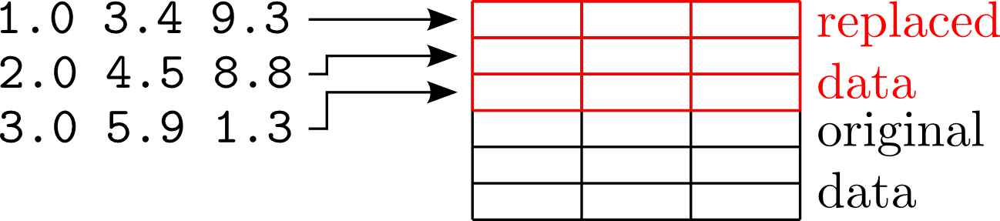

nxtee
=====

Synopsis
--------

:program:`nxtee` is a NeXus utility program quite similar to the standard Unix
:command:`tee` utility. It reads data from standard input and writes it to a 
NeXus object. Calling :program:`nxtee` is fairly simple

.. code-block:: bash

    $ nxtee  NEXUSPATH 

Description
-----------

The program requires no additional command line options. All data received via 
standard input is appended to the NeXus object referenced by *NEXUSPATH*. 
As standard input can only provided a linear stream of data :program:`nxtee`
makes some assumptions about how this data is appended to the target object.
Furthermore there are some limitations in particular when dealing with string
data. 

* for the NeXus object, :program:`nxtee` assumes that the first dimension 
  runs over the number of entries in the particular field. In other words, 
  in order to append the field is grown along the first dimension.
* every line (stream of data terminated with a newline) is assumed to 
  represent a single entry.
* string data can only be written to one dimensional fields where every 
  input line is interpreted as a single element.
* the target object mus already exist. This is necessary as the existing 
  field determines the type of data parsed from standard input.
* one can write only to one object. 

Appending data
~~~~~~~~~~~~~~

   When appending data each line in the ASCII input corresponds to the 
   data reference by an index along the first dimension of the target field

The default operation for :program:`nxtee` is to append data to existing
fields.  As illustrated above the data gets appended along the first dimension
of a field. Every line in the input data corresponds to the data associated
with the residual dimensions of a particular index along the first dimension. 

Replacing data
~~~~~~~~~~~~~~

   With the :option:`-r` the data from the ASCII stream is used to replace
   already existing data in a field. 

When called with the :option:`-r` :program:`nxtee` operates in replace mode. In
this mode the ASCII data is used to replace already existing data in a field. 
By default the replacement starts at the 0-th element along the first
dimension. This can be altered using the :option:`--start-index`.

Program options
---------------

:program:`nxls` accepts the following command line arguments

.. option:: -h, --help
    
   print short program help

.. option:: -b [BEGINCHAR], --begin=[BEGINCHAR]  

   In the case of multidimensional input this denotes the starting charachter

.. option:: -e [ENDCHAR], --end=[ENDCHAR]  

   Terminal symbol for line input

.. option:: -s [SEPCHAR], --separator=[SEPCHAR]  

   separator character for the different entries

.. option:: -r, --replace  

   overwrite the data in an already existing field. If used, the input data 
   must exactly match the size of the field (so that the total content 
   can be written).

.. option:: -a, --append  

   append data to an existing field. This is the default action

.. option:: --start-index=[INDEX OFFSET]  

   when used in replace mode, this option determines the starting index for the
   replacement operation along the first dimension.

Examples
--------

Simple scalar and one dimensional data
~~~~~~~~~~~~~~~~~~~~~~~~~~~~~~~~~~~~~~

The simplest application is also one of the most typical ones. Lets assume that
we want to write the name of the sample in a NeXus file. This can easily be done
with

.. code-block:: bash

    $ echo "S10234_01" | nxtee -r test.nxs://:NXentry/:NXsample/name
    $ nxcat test.nxs://:NXentry/:NXsample/name
    S10234_01

In this case we replace the current content of the *name* field with the new
data provided by standard input. A typical application would be when creating a
file from a template and then change the relevant fields to match the current
situation.

Appending some motor positions to an existing field

.. code-block:: bash

    $ BASE=test.nxs://:NXentry/:NXinstrument/:NXdetector
    $ printf "1.5\n2.0\n3.2\n4.2" | nxtee -a $BASE/theta

Alternatively one can do this also from a file 

.. code-block:: bash

    $ BASE=test.nxs://:NXentry/:NXinstrument/:NXdetector
    $ nxtee -a $BASE/theta < theta.dat

with :file:`heta.dat` having content like this 

.. code-block:: bash

    $ cat theta.dat
    1.5
    2.3
    4.5
    6.7

This approach can be used to easily copy data from an ASCII to a NeXus file.

:program:`nxtee` not only handles NeXus fields but also attributes. This is
particularly useful with the *units* attribute of fields. 

.. code-block:: bash

    $ BASE=test.nxs://:NXentry/:NXinstrument/:NXdetector
    $ echo "m" | nxtee -r $BASE/distance@@units 
    
where a unit can be altered, for instance according to a new hardware setup. 

Working with multidimensional data
~~~~~~~~~~~~~~~~~~~~~~~~~~~~~~~~~~

Multidimensional data requires a bit more work. Lets start with an example where
the *vector* transformation attribute of a field should be altered. 
This can simple be done with

.. code-block:: bash

    $ BASE=test.nxs://:NXentry/:NXinstrument/:NXdetector/:NXtransformation
    $ echo "0 0 1" | nxtee -r $BASE/omega@@vector

Note here that the elements of the input data separated only by a whitespace not
by a newline character. 
In the next example we consider a two dimensional field where the first
dimension represents the number of measurement points and the second the number
of item recorded at each point (in this case only three). 
If we would like to add additional data from an ASCII file we could use the 
same procedure as shown above for the simple motor data

.. code-block:: bash

    $ BASE=test.nxs://:NXentry/:NXsample
    $ nxtee -a $BASE/velocities < velocities.dat

where the data in :file:`velocities.dat` is organized like this

.. code-block:: bash

    $cat velocities.dat
    0.0 2.e-2 3.42
    0.2 1.e-2 9.33
    0.4 3.e-3 0.98

note again that the every line represents a data item along the second dimension
of the target NeXus field.
